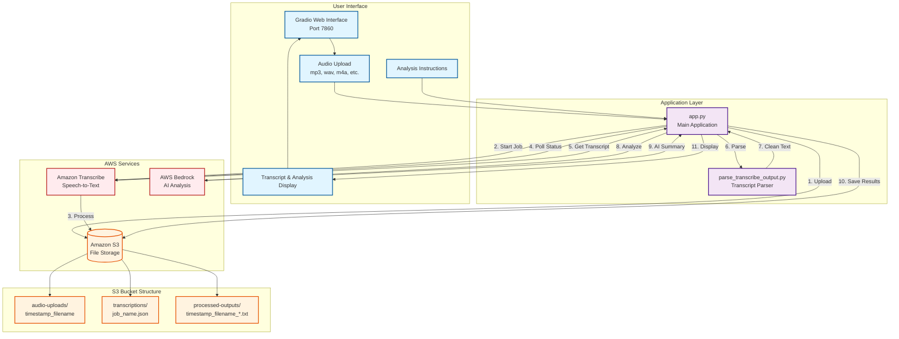
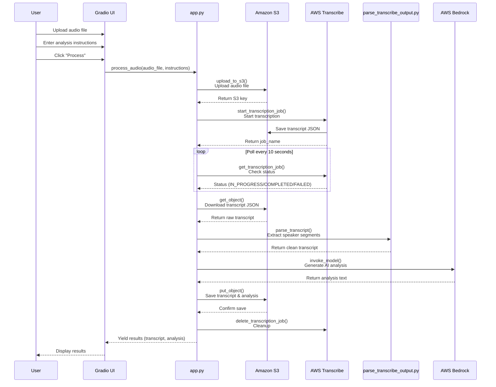
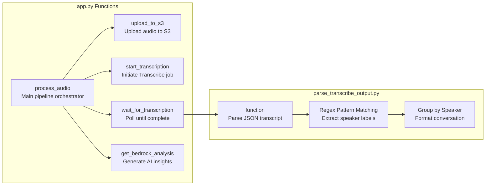

# Application Architecture

```mermaid
graph TB
    subgraph "User Interface"
        UI[Gradio Web Interface<br/>Port 7860]
        Upload[Audio Upload<br/>mp3, wav, m4a, etc.]
        Prompt[Analysis Instructions]
        Results[Transcript & Analysis Display]
    end

    subgraph "Application Layer"
        App[app.py<br/>Main Application]
        Parser[parse_transcribe_output.py<br/>Transcript Parser]
    end

    subgraph "AWS Services"
        S3[(Amazon S3<br/>File Storage)]
        Transcribe[Amazon Transcribe<br/>Speech-to-Text]
        Bedrock[AWS Bedrock<br/>AI Analysis]
    end

    subgraph "S3 Bucket Structure"
        AudioUploads[audio-uploads/<br/>timestamp_filename]
        Transcriptions[transcriptions/<br/>job_name.json]
        ProcessedOutputs[processed-outputs/<br/>timestamp_filename_*.txt]
    end

    %% User Flow
    UI --> Upload
    Upload --> App
    Prompt --> App

    %% Processing Pipeline
    App -->|1. Upload| S3
    S3 --> AudioUploads
    App -->|2. Start Job| Transcribe
    Transcribe -->|3. Process| S3
    S3 --> Transcriptions
    App -->|4. Poll Status| Transcribe
    Transcribe -->|5. Get Transcript| App
    App -->|6. Parse| Parser
    Parser -->|7. Clean Text| App
    App -->|8. Analyze| Bedrock
    Bedrock -->|9. AI Summary| App
    App -->|10. Save Results| S3
    S3 --> ProcessedOutputs
    App -->|11. Display| Results
    Results --> UI

    %% Styling
    classDef uiClass fill:#e1f5ff,stroke:#01579b,stroke-width:2px
    classDef appClass fill:#f3e5f5,stroke:#4a148c,stroke-width:2px
    classDef awsClass fill:#ffebee,stroke:#b71c1c,stroke-width:2px
    classDef s3Class fill:#fff3e0,stroke:#e65100,stroke-width:2px

    class UI,Upload,Prompt,Results uiClass
    class App,Parser appClass
    class Transcribe,Bedrock awsClass
    class S3,AudioUploads,Transcriptions,ProcessedOutputs s3Class
```

## Processing Flow

```mermaid
sequenceDiagram
    participant User
    participant Gradio as Gradio UI
    participant App as app.py
    participant S3 as Amazon S3
    participant Transcribe as AWS Transcribe
    participant Parser as parse_transcribe_output.py
    participant Bedrock as AWS Bedrock

    User->>Gradio: Upload audio file
    User->>Gradio: Enter analysis instructions
    User->>Gradio: Click "Process"
    
    Gradio->>App: process_audio(audio_file, instructions)
    
    App->>S3: upload_to_s3()<br/>Upload audio file
    S3-->>App: Return S3 key
    
    App->>Transcribe: start_transcription_job()<br/>Start transcription
    Transcribe->>S3: Save transcript JSON
    Transcribe-->>App: Return job_name
    
    loop Poll every 10 seconds
        App->>Transcribe: get_transcription_job()<br/>Check status
        Transcribe-->>App: Status (IN_PROGRESS/COMPLETED/FAILED)
    end
    
    App->>S3: get_object()<br/>Download transcript JSON
    S3-->>App: Return raw transcript
    
    App->>Parser: parse_transcript()<br/>Extract speaker segments
    Parser-->>App: Return clean transcript
    
    App->>Bedrock: invoke_model()<br/>Generate AI analysis
    Bedrock-->>App: Return analysis text
    
    App->>S3: put_object()<br/>Save transcript & analysis
    S3-->>App: Confirm save
    
    App->>Transcribe: delete_transcription_job()<br/>Cleanup
    
    App-->>Gradio: Yield results (transcript, analysis)
    Gradio-->>User: Display results
```

## Component Details

```mermaid
graph LR
    subgraph "app.py Functions"
        F1[upload_to_s3<br/>Upload audio to S3]
        F2[start_transcription<br/>Initiate Transcribe job]
        F3[wait_for_transcription<br/>Poll until complete]
        F4[get_bedrock_analysis<br/>Generate AI insights]
        F5[process_audio<br/>Main pipeline orchestrator]
    end

    subgraph "parse_transcribe_output.py"
        P1[function<br/>Parse JSON transcript]
        P2[Regex Pattern Matching<br/>Extract speaker labels]
        P3[Group by Speaker<br/>Format conversation]
    end

    F5 --> F1
    F5 --> F2
    F5 --> F3
    F5 --> F4
    F3 --> P1
    P1 --> P2
    P2 --> P3
```

